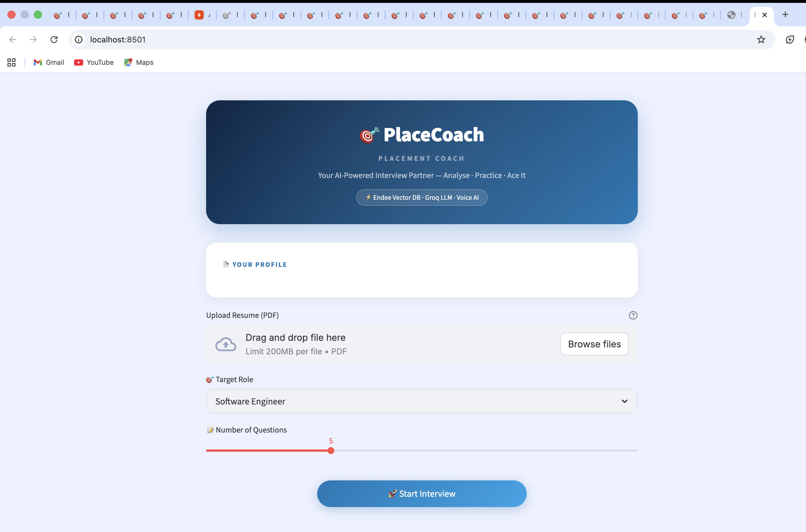
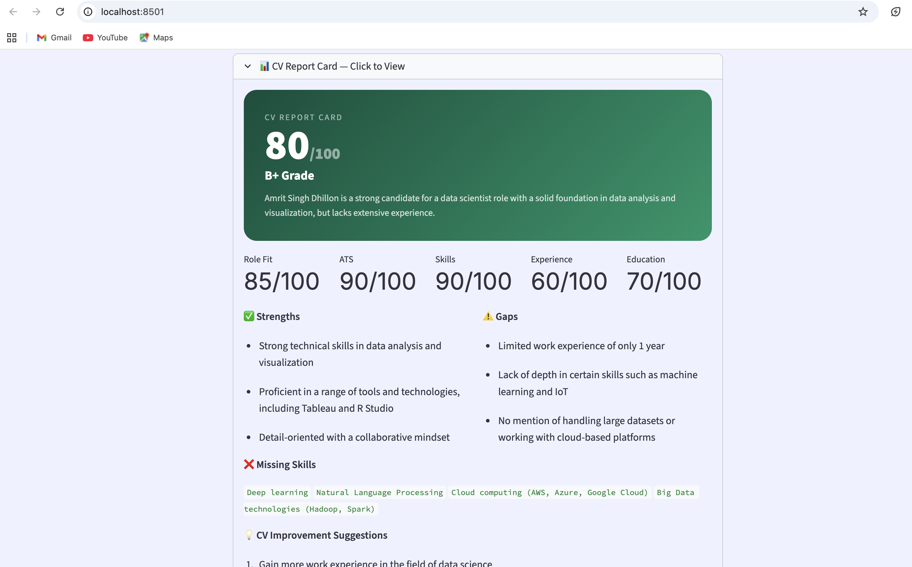
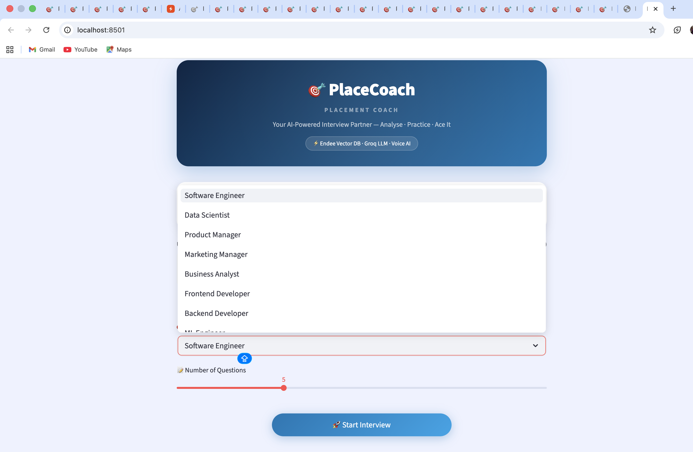
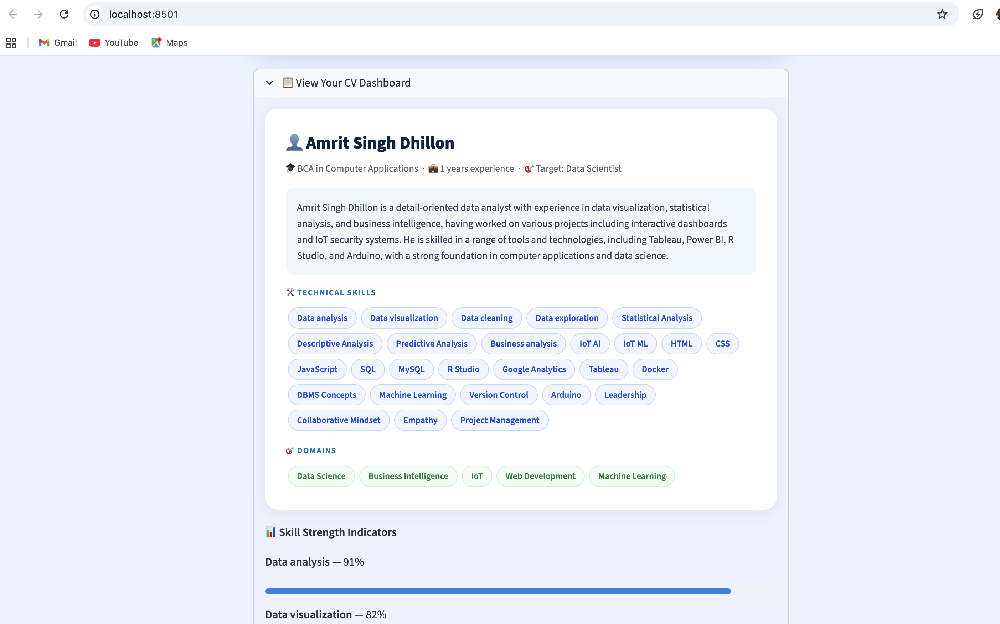

# 🎯 PlaceCoach – AI Placement Coach & Interview Preparation System

> **Intelligent, voice-enabled interview preparation powered by [Endee](https://github.com/endee-io/endee) Vector Database + Groq LLaMA3**


---

## 🎥 Demo Video

[▶️ Click here to watch the full demo](placecoach/screenshots/demo.mov)

---

## 📸 Screenshots

### Home & Setup


### CV Report Card


### Interview Session


### Final Report


---

## 📌 Problem Statement

Students and job seekers struggle with interview preparation because generic question lists do not match their specific skills or target role, there is no personalised feedback on answers, no insight into what is missing from their CV, and no way to practice for specific companies like Google or Amazon.

**PlaceCoach solves all of this** by combining resume analysis, semantic vector search, AI evaluation, voice typing, and a comprehensive CV Report Card into one intelligent platform.

---

## ✨ Key Features

| Feature | Description |
|---|---|
| 📄 **Resume Analysis** | Extracts name, skills, domains, experience using Groq LLM |
| 📊 **CV Report Card** | Scores your CV out of 100 with grade, ATS score, strengths, gaps and suggestions |
| 🔍 **Semantic Question Retrieval** | Finds most relevant questions via Endee vector search |
| 🏢 **Company-Specific Questions** | Target Google, Amazon, Microsoft, TCS, Goldman Sachs and more |
| 🎤 **Voice Typing** | Speak your answers using built-in mic with real-time transcription |
| 🔄 **AI Follow-up Questions** | After each answer, AI asks a deeper follow-up question |
| 🤖 **AI Answer Evaluation** | Scores answers 1-10 with detailed feedback and improvement tips |
| 📈 **Interview Report** | Full breakdown with per-question scores and overall career advice |
| 💬 **Chat Bubble UI** | WhatsApp-style conversation interface |
| 🎯 **15+ Job Roles** | SWE, DS, PM, Marketing, Finance, HR, DevOps and more |
| 💬 **150+ Questions** | Curated question bank covering technical and behavioural areas |

---

## 🏗️ System Design
```
+------------------------------------------------------------------+
|                      USER (Streamlit UI)                         |
|              Chat Bubble Interface + Voice Typing                |
+------------------------------------------------------------------+
                         |  Resume PDF + Target Role + Company
                         v
+------------------------------------------------------------------+
|                     RESUME PARSER                                |
|   pdfplumber extracts text → Groq LLM structures into:          |
|   {name, skills, domains, experience, education, summary}       |
+------------------------------------------------------------------+
                         v
+------------------------------------------------------------------+
|                   CV REPORT CARD ENGINE                          |
|   Groq LLM analyses CV vs role → Score/100, ATS, gaps, tips    |
+------------------------------------------------------------------+
                         v
+------------------------------------------------------------------+
|              RAG QUESTION RETRIEVAL (via Endee)                  |
|   Embed query → Search Endee → Top-20 → LLM selects best N     |
+------------------------------------------------------------------+
                         v
+------------------------------------------------------------------+
|           INTERACTIVE INTERVIEW SESSION                          |
|   Voice/text input → AI evaluates → Follow-up question         |
+------------------------------------------------------------------+
                         v
+------------------------------------------------------------------+
|                   INTERVIEW REPORT                               |
|   Score + grade + feedback + CV analysis + career advice        |
+------------------------------------------------------------------+

ENDEE VECTOR DB (runs via Docker):
  150+ curated questions → Embed (MiniLM) → Upsert into Endee
  At query time: embed query → cosine similarity → top-K results
```

---

## 🗄️ How Endee is Used

Endee is the **core semantic search engine** of PlaceCoach.

### Creating the Index
```python
from endee import Endee, Precision

client = Endee()
client.set_base_url("http://localhost:8080/api/v1")
client.create_index(
    name="interview_questions",
    dimension=384,
    space_type="cosine",
    precision=Precision.INT8
)
```

### Indexing 150+ Questions
```python
index = client.get_index(name="interview_questions")
index.upsert([
    {
        "id": "se_001",
        "vector": model.encode("Explain SOLID principles").tolist(),
        "meta": {
            "text": "Explain SOLID principles...",
            "role": "Software Engineer",
            "category": "OOP"
        }
    }
])
```

### Semantic Retrieval
```python
query = "Software Engineer Google interview. Skills: Python, System Design."
results = index.query(vector=model.encode(query).tolist(), top_k=20)
```

---

## 📊 CV Report Card

After uploading your resume, you instantly get:
- **Overall CV Score** out of 100 with A+/A/B+/B/C grade
- **Role Fit Score, ATS Score, Skills Score, Experience Score, Education Score**
- **Strengths** — what is working in your CV
- **Gaps** — what is weak or missing for the target role
- **Missing Skills** — specific skills to add
- **Improvement Suggestions** — actionable steps to improve your CV
- **ATS Optimization Tips** — how to beat resume scanners

---

## 🎤 Voice Typing

Built-in voice input using the Web Speech API. Click the mic button, speak your answer, text appears in real-time in the answer box. Works best in Chrome browser.

---

## 🏢 Company-Specific Questions

Select your target company to get tailored questions:
- **Tech Giants**: Google, Amazon, Microsoft, Meta, Apple
- **Indian IT**: Flipkart, Infosys, TCS, Wipro, Accenture
- **Finance/Consulting**: Goldman Sachs, McKinsey, Deloitte
- **Startups**: Generic startup culture questions

---

## 🔄 AI Follow-up Questions

After each answer, the AI automatically generates a deeper follow-up question based on what you said — just like a real interviewer probing for more depth.

---

## 🛠️ Setup & Execution

### Prerequisites
- Python 3.10+
- Docker and Docker Compose
- [Free Groq API Key](https://console.groq.com)
- Chrome browser (for voice typing)

### Step 1: Clone the Repository
```bash
git clone https://github.com/Amritdhillon26/endee
cd endee/placecoach
```

### Step 2: Start Endee Vector Database
```bash
docker compose up -d
```

### Step 3: Install Dependencies
```bash
python3 -m venv venv
source venv/bin/activate
pip install -r requirements.txt
```

### Step 4: Configure Environment
```bash
cp .env.example .env
# Add your GROQ_API_KEY to .env
```

### Step 5: Launch PlaceCoach
```bash
streamlit run app.py
```
Open http://localhost:8501 in Chrome.

### Step 6: Use It
1. Upload your **resume PDF**
2. Select **target role** and **company**
3. Click **Start Interview** — CV Report Card generates instantly
4. Answer by **typing or speaking** using the mic button
5. Get **AI follow-up questions** after each answer
6. Review your full **Interview Report** with scores and career advice

---

## 📂 Project Structure
```
placecoach/
├── app.py              # Main Streamlit UI (chat + voice)
├── cv_analyzer.py      # CV Report Card engine (score/100)
├── rag_engine.py       # RAG retrieval + evaluation + follow-ups
├── question_bank.py    # 150+ questions + Endee indexing
├── resume_parser.py    # PDF parsing + LLM structuring
├── requirements.txt
├── docker-compose.yml  # Endee vector DB
├── .env.example
└── README.md
```

---

## 🔧 Tech Stack

| Component | Technology |
|---|---|
| Vector Database | **Endee** (HNSW, cosine similarity, INT8) |
| Embedding Model | **all-MiniLM-L6-v2** (384-dim) |
| LLM | **Groq LLaMA3-3-70b-versatile** (free, ultra-fast) |
| UI | **Streamlit** |
| Voice Input | **Web Speech API** (Chrome) |
| PDF Parsing | **pdfplumber** |

---

## 📄 License

Apache 2.0 License — see [LICENSE](../../LICENSE)

Built on [Endee](https://github.com/endee-io/endee). Forked from endee-io/endee as required by project guidelines.
